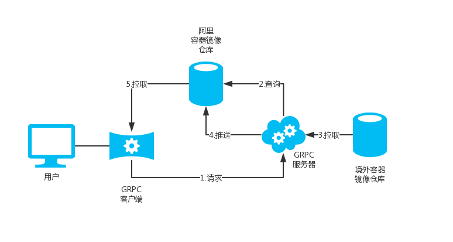

## image-pull
基于 GRPC/Python3 开发，用于拉取 k8s.gcr.io、 quay.io等境外仓库中的镜像工具。


### 工作原理



拉取存在两种情况：
- 阿里容器镜像仓库已经存在缓存，
那么直接映射镜像仓库中的容器镜像名拉取即可。
- 阿里容器镜像仓库不存在缓存，则gRPC服务器会先将容器镜像拉取至
容器镜像仓库中，接着映射镜像仓库中的容器镜像名拉取，整个过程会比较耗时。
> 设计主要考虑避免gRPC服务器针对国内带宽不稳定，存储空间不足并且尽最大努力节约gRPC服务器流量与带宽资源。
### 用法
- 运行容器拉取指定镜像
```bash
docker run --rm -it \
        -v /root/image.txt:/image-pull/image.txt \
        -v /var/run/docker.sock:/var/run/docker.sock  \
        registry.cn-hangzhou.aliyuncs.com/geekcloud/image-pull:latest
```
> /root/image.txt (每行一个镜像名)
```text
k8s.gcr.io/kube-apiserver:v1.13.3
k8s.gcr.io/kube-controller-manager:v1.13.3
k8s.gcr.io/kube-scheduler:v1.13.3
k8s.gcr.io/kube-proxy:v1.13.3
k8s.gcr.io/pause:3.1
k8s.gcr.io/etcd:3.2.24
k8s.gcr.io/coredns:1.2.6
```
- 通过命令行拉取指定镜像：
```bash
docker run --rm -it \
       -v /var/run/docker.sock:/var/run/docker.sock \
       registry.cn-hangzhou.aliyuncs.com/geekcloud/image-pull:latest \
       gcr.io/kubernetes-helm/tiller:v2.13.0
# 这里的 gcr.io/kubernetes-helm/tiller:v2.13.0 为你想要拉取的镜像
```
### 境外服务器节点部署
- 配置
重命名`settings-example.py`文件为`settings.py`，并设置相关参数
```bash
# 仓库地址
RepoUrl = "registry.cn-hangzhou.aliyuncs.com"
# 仓库命名空间
RepoNamespace = "sp"
# 以下为阿里云镜像仓库配置参数：
# 产品名
Product_name = "cr"
# 镜像仓库所在位置
Region_id = "cn-hangzhou"
# 镜像仓库节点名
End_point = "cr.cn-hangzhou.aliyuncs.com"
# 阿里云镜像仓库 RAM 用户ID
id = "123"
# 阿里云镜像仓库 RAM 用户key
key = "666"
# 阿里云镜像仓库 RAM 用户名
username = "admin"
# 阿里云镜像仓库 RAM 密码
password = "123"
# 境外服务器工作端口
server_listen = '[::]:50051'
# 境外服务器域名或地址
host= "www.example.com"
```
- 安装依赖与部署
```shell
pip3 install -r requirements.txt
python3 server.py
```
